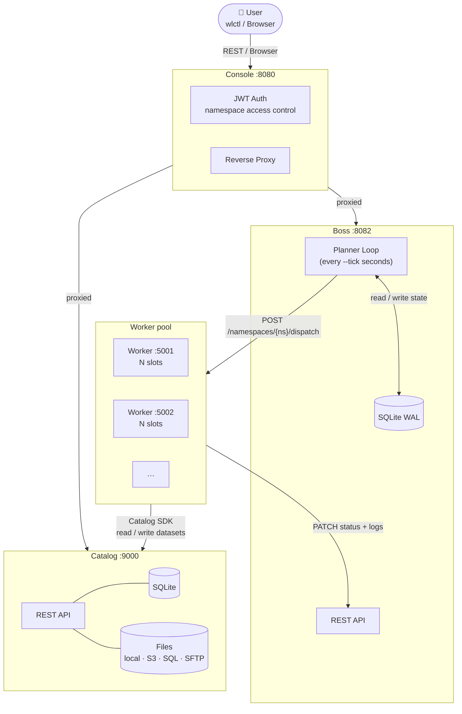

# Waluigi

A lightweight distributed task orchestrator with a **server-push architecture**: the Boss schedules tasks and pushes them to Workers via HTTP. Workers are passive executors — they register, wait for dispatch, and report back.

---

## Architecture at a glance



Four independent processes communicate over HTTP. The Boss holds all orchestration state. The Catalog is optional but enables first-class dataset management. The Console provides a web UI with authentication.

---

## Installation

```bash
pip install waluigi
```

---

## Components

| Component | Command | Default port | Role |
|-----------|---------|-------------|------|
| Boss | `wlboss` | 8082 | Control plane — SQLite state, planner loop, DAG scheduling |
| Worker | `wlworker` | 5001 | Execution plane — subprocess runner, log streaming |
| Catalog | `wlcatalog` | 9000 | Data catalog — dataset metadata, schema, lineage, DQ |
| Console | `wlconsole` | 8080 | Web UI — JWT auth, namespace access control, reverse proxy |
| CLI | `wlctl` | — | Command-line client for Boss and Catalog |

All options are configurable via CLI flags or environment variables with component prefixes:
`WALUIGI_BOSS_*`, `WALUIGI_WORKER_*`, `WALUIGI_CATALOG_*`, `WALUIGI_CONSOLE_*`.

---

## Quick start

### 1. Start the cluster

```bash
# Boss
wlboss --port 8082 --db-url sqlite:///./db/waluigi.db

# Worker (one or more)
wlworker --boss-url http://localhost:8082 --port 5001 --slots 4

# Catalog (optional)
wlcatalog --port 9000 --db-url sqlite:///./db/catalog.db --data-path ./data

# Console (optional)
wlconsole --port 8080 \
  --boss-url http://localhost:8082 \
  --catalog-url http://localhost:9000 \
  --secret-key change-me-in-production
```

Or with Docker Compose:

```bash
docker compose up
```

### 2. Create a namespace, resources, and task definitions

```bash
wlctl apply -f descriptors/namespaces/analytics.yaml
wlctl apply -f descriptors/resources/resources.yaml

# Apply built-in task definitions if you plan to use taskRef
wlctl apply-builtins -n analytics
```

### 3. Submit a job

```bash
wlctl apply -f descriptors/jobs/analytics-by-command-job.yaml
```

### 4. Monitor execution

```bash
wlctl get jobs --namespace analytics
wlctl get tasks --namespace analytics
wlctl logs <task_id> --follow
```

---

## Defining a Job

Jobs are YAML descriptors. Tasks are defined inline (`jobSpec`) or by referencing a reusable `JobDefinition` (`jobRef`).

### Inline job with shell commands

```yaml
kind: Job
metadata:
  name: daily-extract
  namespace: analytics
spec:
  executionPolicy: Ephemeral   # new instance on each submit (default)
  params:
    date: "2026-06-12"
  jobSpec:
    tasks:
      - id: extract
        taskSpec:
          command: "python pipeline/extract.py"
          affinity:
            - python
        params:
          source: "ERP"
        resources:
          coin: 1

      - id: transform
        taskSpec:
          command: "python pipeline/transform.py"
          affinity:
            - python
        requires:
          - extract
        resources:
          coin: 2
```

### Inline job with Python scripts

```yaml
kind: Job
metadata:
  name: inline-job
  namespace: analytics
spec:
  params:
    date: "2026-06-12"
  jobSpec:
    tasks:
      - id: process
        taskSpec:
          script: |
            from waluigi.sdk.context import context
            print(f"Processing date: {context.params.date}")
        resources:
          coin: 1
```

### Job referencing a reusable definition

```yaml
kind: Job
metadata:
  name: erp-run
  namespace: analytics
spec:
  executionPolicy: Stateful
  concurrencyPolicy: Forbid
  params:
    date: "2026-06-12"
  jobRef:
    name: erp-analytics-pipeline
```

→ Full YAML reference: [doc/yaml-reference.md](doc/yaml-reference.md)

---

## Writing Tasks

Tasks are any executable (Python, bash, …) that reads environment variables and exits with code 0 for success.

```python
# pipeline/extract.py
from waluigi.sdk.context import context

date   = context.params.date          # WALUIGI_PARAM_DATE
source = context.params.source        # WALUIGI_PARAM_SOURCE
owner  = context.attributes.owner     # WALUIGI_ATTRIBUTE_OWNER
cfg    = context.config               # from task config: dict

print(f"Extracting {source} for {date}")
# ... do work, exit 0 on success
```

→ Full guide: [doc/task-development.md](doc/task-development.md)

### Built-in task types

Reference reusable transformations without writing any code. First, apply the built-in `TaskDefinition` descriptors to the namespace:

```bash
wlctl apply-builtins -n analytics
```

Then reference them in jobs with `taskRef.name`:

```yaml
- id: filter_high_value
  taskRef:
    name: FilterDataset
  config:
    input:
      dataset: analytics/erp/clean/erp
    output:
      dataset: analytics/erp/filtered/high_value
      source_id: local
      format: parquet
    where: "value > 1000"
  resources:
    coin: 1
```

Available types: `FilterDataset`, `SelectColumns`, `AddDerivedColumns`, `AggregateDataset`, `JoinDatasets`, `MergeDatasets`, `PivotDataset`, `DeduplicateDataset`, `AccumulateDataset`, `AccumulateDeduplicateDataset`, `UpsertDataset`, `CatalogCreateDataset`, `CatalogCreateSource`, `CatalogDefineSchema`, `CatalogSetExpectations`, `CatalogSetCharts`, `IngestRest`, `SharePointExport`.

→ Full reference: [doc/built-in-tasks.md](doc/built-in-tasks.md)

---

## Resource Management

Resources are named pools — model CPU shares, GPU units, API rate limits, or anything finite. The Boss enforces limits cluster-wide: a task is dispatched only when enough resources are available.

```yaml
# Define pools per namespace
kind: NamespaceResources
metadata:
  namespace: analytics
spec:
  coin: 10.0
  gpu: 2.0
```

```yaml
# Task declares consumption
- id: train
  taskSpec:
    command: python train.py
  resources:
    coin: 2
    gpu: 1
```

---

## Worker Affinity

Workers declare capability tags; tasks declare requirements. The Boss dispatches a task only to workers whose affinity is a **superset** of what the task requires.

```bash
# Worker with Python and pandas available
wlworker --affinity python,pandas --port 5001

# Worker with GPU
wlworker --affinity python,gpu --port 5002
```

```yaml
# Task requires python+gpu — affinity goes inside taskSpec
- id: train
  taskSpec:
    command: python train.py
    affinity:
      - python
      - gpu
```

If no matching worker is available, the task waits until one registers.

---

## Scheduled Jobs (CronJobs)

```yaml
kind: CronJob
metadata:
  name: daily-etl
  namespace: analytics
spec:
  schedule: "0 6 * * *"
  timezone: Europe/Rome
  enabled: true
  executionPolicy: Ephemeral
  concurrencyPolicy: Forbid
  params:
    date: "%Y-%m-%d"          # strftime interpolation at run time
  jobRef:
    name: erp-analytics-pipeline
```

---

## Catalog Integration

The Catalog tracks datasets, versions, schema, lineage, and data quality results. Task scripts interact with it via the SDK:

```python
from waluigi.sdk.catalog import CatalogClient

catalog = CatalogClient()    # reads WALUIGI_CATALOG_URL + WALUIGI_CATALOG_NAMESPACE

# Read a dataset
reader = catalog.read_dataset("sales/raw/orders")
df = reader.read()

# Write a dataset (two-phase commit)
handle = catalog.create_dataset("sales/clean/orders", format="parquet", source_id="local")
with handle.create_version(metadata={"date": date}, inputs=[reader]) as writer:
    writer.write(df_clean)
```

→ Full guide: [doc/catalog.md](doc/catalog.md) · [doc/sdk.md](doc/sdk.md)

---

## CLI Quick Reference

```bash
wlctl --url http://localhost:8082 <command>

# Apply descriptors
wlctl apply -f descriptor.yaml

# Inspect
wlctl get namespaces
wlctl get jobs [--namespace <ns>]
wlctl get tasks [--namespace <ns>] [--job-id <id>]
wlctl get workers
wlctl get resources [--namespace <ns>]
wlctl get task-definitions [--namespace <ns>]
wlctl get job-definitions [--namespace <ns>]
wlctl get cronjobs [--namespace <ns>]

# Describe definitions
wlctl describe task-definition <name> [--namespace <ns>]
wlctl describe job-definition <name> [--namespace <ns>]
wlctl describe job <job_id> [--namespace <ns>]

# Logs
wlctl logs <task_id> [-n <lines>] [--follow]

# Lifecycle
wlctl reset task <task_id> [--namespace <ns>]
wlctl reset job <job_id> [--namespace <ns>]
wlctl reset namespace <ns>

wlctl delete job <job_id> [--namespace <ns>]
wlctl delete cronjob <id> [--namespace <ns>]
wlctl delete taskdefinition <name> [--namespace <ns>]
wlctl delete jobdefinition <name> [--namespace <ns>]
wlctl delete namespace <ns>
```

→ Full reference: [doc/cli.md](doc/cli.md)

---

## Documentation

| Document | Contents |
|----------|----------|
| [doc/architecture.md](doc/architecture.md) | System design, components, DAG engine internals, deployment |
| [doc/yaml-reference.md](doc/yaml-reference.md) | Complete YAML spec for every kind |
| [doc/task-development.md](doc/task-development.md) | Writing tasks, SDK context, environment variables |
| [doc/built-in-tasks.md](doc/built-in-tasks.md) | All built-in taskRef types with config schemas |
| [doc/catalog.md](doc/catalog.md) | Catalog service: sources, datasets, schema, lineage, DQ, charts |
| [doc/sdk.md](doc/sdk.md) | CatalogClient, DatasetReader/Writer, connectors, context |
| [doc/data-quality.md](doc/data-quality.md) | DQ rules, suites, DQManager |
| [doc/cli.md](doc/cli.md) | Complete `wlctl` command reference |
| [doc/deployment.md](doc/deployment.md) | Docker Compose, Swarm, Kubernetes, environment variables |

---

## Deployment

```bash
# Docker Compose (Boss + 3 Workers + Catalog + Console)
docker compose up

# Docker Swarm
docker swarm init
docker stack deploy -c docker-compose.yml waluigi
```

→ Full guide: [doc/deployment.md](doc/deployment.md)

---

## Differences from Luigi

| | Luigi | Waluigi |
|---|---|---|
| Architecture | In-process scheduler | Boss/Worker over HTTP |
| Task dispatch | Worker polls | Boss pushes |
| Execution | Python functions | Shell commands — any language |
| State | In-memory | SQLite (WAL mode) |
| Scaling | Single process | Multiple workers, multiple boss replicas |
| Resource limits | Yes | Yes (named pools, namespace-scoped) |
| Worker affinity | No | Yes (capability tag matching) |
| Scheduled jobs | External | Built-in CronJob scheduler |
| Dataset catalog | No | Optional full catalog service |
| Multi-boss HA | No | Yes (atomic job claiming via SQLite) |
