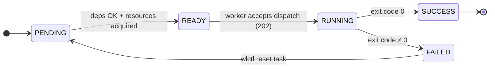
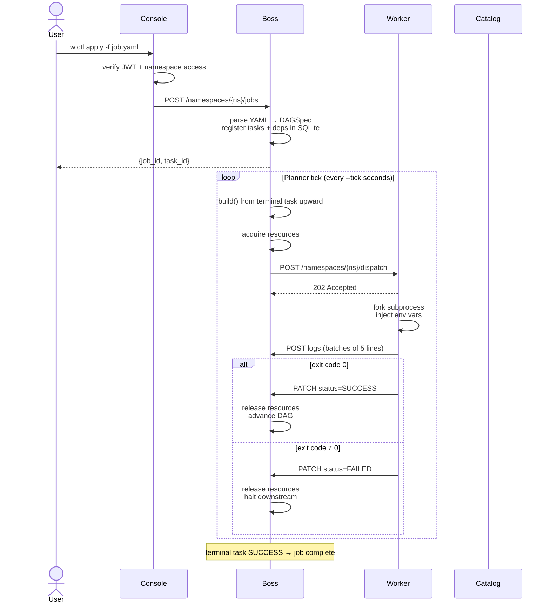

# Architecture

## Overview

Waluigi is composed of four independent processes that communicate over HTTP. They can run on the same machine, on separate VMs, or be distributed across a cluster.

```
  ┌────────────────────────────────────────────────────────┐
  │  CLI (wlctl)                                           │
  │  wlctl apply -f job.yaml    wlctl get tasks            │
  └────────────────┬───────────────────────────────────────┘
                   │ REST (via Console proxy or direct)
                   ▼
  ┌────────────────────────────────────────────────────────┐
  │  Console  :8080                                        │
  │  • JWT auth (HS256 / PBKDF2)                          │
  │  • Namespace access control                            │
  │  • Reverse proxy → Boss and Catalog                    │
  │  • Static SPA (Vue, AdminLTE)                         │
  └────────┬────────────────────────┬───────────────────────┘
           │                        │
           ▼                        ▼
  ┌─────────────────┐    ┌──────────────────────┐
  │  Boss  :8082    │    │  Catalog  :9000       │
  │  SQLite (WAL)   │    │  SQLite               │
  │  Planner loop   │    │  Sources & Datasets   │
  │  DAG Engine     │    │  Schema & Lineage     │
  │  REST API       │    │  DQ & Charts          │
  └────────┬────────┘    └──────────────────────┘
           │ POST /namespaces/{ns}/dispatch
           │ PATCH /namespaces/{ns}/tasks/{id}  (status/logs)
           ▼
  ┌─────────────────────────────────────────────┐
  │  Worker pool                                │
  │  ┌────────────┐  ┌────────────┐             │
  │  │ Worker :5001│  │ Worker :5002│  …        │
  │  │ asyncio    │  │ asyncio    │             │
  │  │ subprocess │  │ subprocess │             │
  │  └────────────┘  └────────────┘             │
  └─────────────────────────────────────────────┘
```

---

## Boss

The Boss is the control plane. Its responsibilities:

- Store all state in SQLite (jobs, tasks, workers, resources, definitions)
- Run a continuous planner loop that evaluates DAGs and dispatches ready tasks
- Enforce cluster-wide resource limits before dispatch
- Receive status updates and logs from workers
- Expose a full REST API for the CLI, Console, and SDK

### Planner loop

The planner runs continuously (every few seconds). On each tick it:

1. Loads all `PENDING` jobs
2. For each job, calls `engine.build()` recursively from the terminal task upward
3. `build()` returns `True` (all SUCCESS), `False` (blocked), `None` (FAILED), or `"PAUSE"` (all workers saturated)
4. Tasks whose dependencies are all SUCCESS and whose resources are available are marked `READY` and dispatched

### DAG engine (`engine.py`)

`build(namespace, job_metadata, spec, task_id, _memo)` is the recursive planner:

```
terminal task
    └─ check status
        SUCCESS → return True
        FAILED  → return None  (propagate)
        RUNNING → return False (blocked, retry)
        PENDING →
            for each dependency:
                recurse build(dep_id)
                if dep = None  → return None
                if dep = False → mark task PENDING, return False
            all deps True →
                if task.type (taskRef): resolve TaskDefinition from DB
                    → get command, script, affinity from definition
                    → if not found → FAILED
                acquire resources (or return False/PAUSE)
                mark task READY
                dispatch to worker
                return False  (will become True when worker reports SUCCESS)
```

### TaskDefinitions

All `taskRef` types are resolved at dispatch time against `TaskDefinition` records stored in the namespace. There is no built-in registry — built-in task types (FilterDataset, etc.) must be explicitly applied as `TaskDefinition` descriptors in each namespace where they will be used:

```bash
wlctl apply-builtins -n analytics
```

The `TaskDefinition` spec contains `command` (or `script`) and `affinity`. Resources are **never** part of a `TaskDefinition` — they are declared on the task in the `Job`/`JobDefinition` YAML.

### Affinity

Workers declare capability tags (`--affinity python,gpu`). Tasks declare requirements inside `taskSpec.affinity` (for inline tasks) or in `TaskDefinition.spec.affinity` (for `taskRef` tasks). The Boss filters eligible workers before dispatch:

```
task.affinity ⊆ worker.affinity  →  eligible
```

A task with no affinity requirements can run on any worker. If no eligible worker is available, the Boss returns RETRY and the task waits for the next planning tick.

The `_memo` dict deduplicates shared dependencies. In a diamond DAG (`A → B, A → C, B → D, C → D`), task `A` is evaluated exactly once per planning cycle.

### Task state machine



- `PENDING` — waiting (dependency not done, resource unavailable, or explicitly reset)
- `READY` — resources acquired, dispatched to worker, waiting for 202 acknowledgement
- `RUNNING` — worker accepted the task and is executing
- `SUCCESS` — exit code 0; task will never re-run with the same params (idempotent)
- `FAILED` — exit code non-zero; must be explicitly reset via `wlctl reset task`

### Task identity and idempotency

Each task record is keyed by `(namespace, task_id, params_hash)`. Two submissions with the same task ID but different params produce distinct records. `SUCCESS` tasks are never re-dispatched — safe job resubmission.

```python
params_hash = " ".join(f"{k}:{v}" for k, v in sorted(params.items()))
```

### SQLite WAL and multi-boss

Boss uses WAL mode with `busy_timeout=30s`. Multiple Boss replicas can run concurrently; they coordinate via atomic `UPDATE ... RETURNING` job claiming — each replica atomically claims a different job, preventing duplicate planning. Each thread gets its own connection via `threading.local`.

---

## Worker

The Worker is the execution plane. Responsibilities:

- Register with the Boss via periodic heartbeat
- Accept task dispatches via `POST /namespaces/{ns}/dispatch`
- Fork a subprocess for each task, inject environment variables
- Stream stdout/stderr in 5-line batches back to the Boss
- Report final status (`SUCCESS` or `FAILED`) via `PATCH /namespaces/{ns}/tasks/{id}`

### Slot management

Each Worker has a configurable number of execution slots (`--slots`, default 2). On dispatch the Worker atomically acquires a slot; on completion it releases it. If no slot is available it returns HTTP 429, and the Boss tries another worker.

### Heartbeat

Every `--heartbeat` seconds (default 10s) the Worker registers with the Boss:

```json
{
  "url": "http://worker-1:5001",
  "max_slots": 4,
  "free_slots": 2,
  "affinity": ["python", "gpu"],
  "status": "ALIVE"
}
```

The Boss uses `free_slots` and `affinity` for dispatch decisions. Workers that stop heartbeating are removed from the available pool.

### Affinity matching

The Boss filters workers before dispatching a task:

```
task.affinity ⊆ worker.affinity  →  eligible
```

A task with no affinity requirements can be dispatched to any worker. A worker with no declared affinity only receives tasks with no requirements.

For inline `taskSpec` tasks, affinity is declared inside `taskSpec`. For `taskRef` tasks, it is resolved from the `TaskDefinition` at dispatch time.

---

## Catalog

The Catalog is an independent service that tracks dataset metadata. It is optional — jobs that don't use the SDK for I/O don't need it.

Core concepts:

- **Source** — a storage backend (local filesystem, S3, SQL database, SFTP). Datasets belong to a source.
- **Dataset** — a logical data asset with an ID path (e.g., `sales/raw/orders`). Tracks format, schema, status, DQ expectations.
- **Version** — a physical snapshot of a dataset created via two-phase commit (reserve → write → commit). Versions are immutable once committed.
- **Schema** — inferred automatically on commit; can be enriched with types, PII flags, descriptions.
- **Lineage** — version-level upstream/downstream relationships recorded by the SDK on write.
- **Data Quality** — expectations (rules) attached to a dataset; evaluated per version.
- **Charts** — ECharts-based visualisation definitions attached to a dataset.

All resources are scoped to a `namespace` (path prefix `/namespaces/{namespace}/...`).

### Dataset lifecycle

```
draft ──► in_review ──► approved ──► deprecated
```

Versions flow through their own lifecycle:

```
reserved ──► committed
          └► failed
```

---

## Console

The Console is an authenticated reverse proxy and web UI. It:

- Serves a single-page application (Vue 3, no-build, AdminLTE)
- Issues JWT tokens (HS256) on login via PBKDF2 password verification
- Enforces namespace access control: requests for `namespaces/{ns}/...` are allowed only if the JWT contains that namespace
- Proxies all remaining requests transparently to Boss and Catalog

Users are stored in a local SQLite table. Admin users can create/update/delete users and manage namespace assignments.

---

## Data flow: job submission to completion



---

## Deployment architectures

### Single machine (development)

```bash
wlboss &
wlworker --slots 4 &
wlcatalog &
wlconsole &
```

### Docker Compose

```bash
docker compose up
```

The included `docker-compose.yml` starts Boss, 3 Workers, Catalog, and Console. Workers share a volume for the working directory; Boss and Catalog each have their own SQLite volume.

### Docker Swarm (multi-boss HA)

```bash
docker swarm init
docker stack deploy -c docker-compose.yml waluigi
```

Multiple Boss replicas are safe because of atomic job claiming. Workers reach Boss via Swarm's ingress load balancer (`http://boss:8082`).

### Kubernetes

Mount the Boss SQLite file on a shared `ReadWriteMany` volume (NFS, EFS). Expose Boss via a `ClusterIP` service:

```yaml
apiVersion: apps/v1
kind: Deployment
metadata:
  name: waluigi-boss
spec:
  replicas: 2
  template:
    spec:
      containers:
        - name: boss
          image: buzzobuono/waluigi-bossd:latest
          env:
            - name: WALUIGI_BOSS_DB_PATH
              value: /db/waluigi.db
          volumeMounts:
            - name: db
              mountPath: /db
      volumes:
        - name: db
          persistentVolumeClaim:
            claimName: waluigi-db-pvc   # ReadWriteMany
```

> SQLite on NFS can have locking issues under high write concurrency. For large deployments consider migrating to a PostgreSQL backend.

→ See [deployment.md](deployment.md) for complete Docker and Kubernetes configurations.
